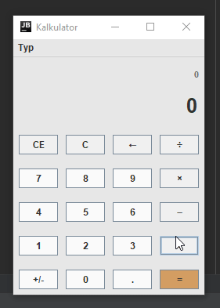

### Co dodałem

- Normalnie działający zwykły kalkulator 
- Kalkulator NWD
- Zmienione kolorki z domyślnych obrzydliwych Swingowych na podobne do kalkulatora z Windowsa 10, mi się podobają

### Kiedyś dodam

- Kalkulator "naukowy", z jakimiś funkcjami w stylu nawiasy itp
- Jakieś kalulatory do zmieniania wartości w stylu mile na kilometry

# Póki co, całkowicie zwykły kalkulator w Javie
To mój, w pełni w sumie działający, kalkulator w Javie bo uczyłem się Swinga i pomyślałem, że sprawdzę sobie co dam radę zrobić

